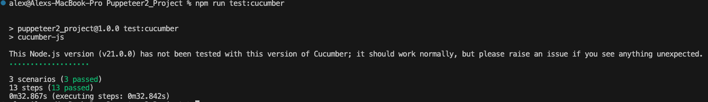

# Puppeteer Test Project

Этот проект содержит автоматизированные тесты, написанные с использованием Puppeteer, Jest и Cucumber для тестирования функционала бронирования билетов на веб-сайте. Тесты написаны с использованием подхода BDD (Behavior-Driven Development).

## Результаты тестов

 
